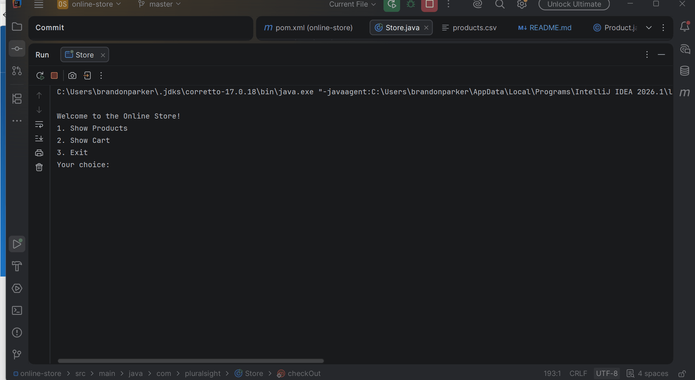

# Project Title

Brandon's Online Store
## Description of the Project

"This is a Java shopping application that simulates an online store. 
It allows customers to browse a catalog of products, add items to their shopping cart, and complete purchases. 
The app stores all product data in a CSV file and provides a menu for shopping. 
It's designed for anyone who wants to practice building an e-commerce experience using Java."
## User Stories

- As a customer, I want to view all available products so that I can decide what to buy
- As a customer, I want to add products to my cart so that I can purchase multiple items at once
- As a customer, I want to see my total cost before checkout so that I know how much I'm spending
- As a customer, I want to receive a receipt after checkout so that I have a record of my purchase

## Setup

Instructions on how to set up and run the project using IntelliJ IDEA.

### Prerequisites

- IntelliJ IDEA: Ensure you have IntelliJ IDEA installed, which you can download from [here](https://www.jetbrains.com/idea/download/).
- Java SDK: Make sure Java SDK is installed and configured in IntelliJ.

### Running the Application in IntelliJ

Follow these steps to get your application running within IntelliJ IDEA:

1. Open IntelliJ IDEA.
2. Select "Open" and navigate to the directory where you cloned or downloaded the project.
3. After the project opens, wait for IntelliJ to index the files and set up the project.
4. Find the main class with the `public static void main(String[] args)` method.
5. Right-click on the file and select 'Run 'YourMainClassName.main()'' to start the application.

## Technologies Used

- Java: 17
- GitHub

## Demo

## Future Work

- Add a GUI instead of CLI so it's easier to use

- Add a search and filter feature so customers can find products by name or price range

## Resources

- Raymond's Github Notes

## Team Members

- **Name 1** - Brandon Parker (App developer)
- **Name 2** - Raymond Mauron (Provided Skeleton code)

## Thanks

Thank you Raymond for the Support through class & the notes/resources. Also thank you (the viewer) for trying out my application!